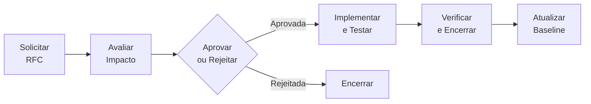
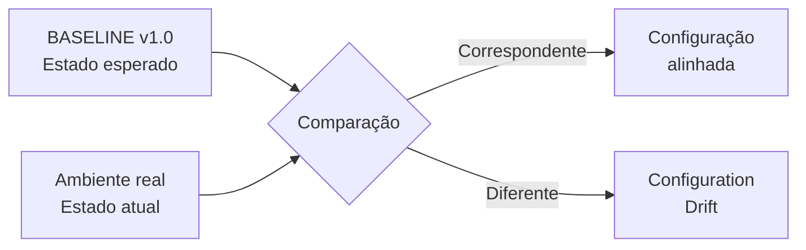

# BASELINE v1.0 — Sistema de Pedidos

> **Marco de referência inicial da configuração oficial, estável e aprovada do Sistema de Pedidos.**

---

## Identificação da Baseline

| Informação                     | Registro                        |
| ------------------------------- | -------------------------------- |
| **Baseline**                    | v1.0                             |
| **Baseline anterior**           | Nenhuma (baseline inicial)       |
| **Sistema**                     | Sistema de Pedidos               |
| **Status**                      | Aprovada                         |
| **RFC relacionada**             | Nenhuma (configuração inicial)   |
| **Data de criação**             | [Preencher]                      |
| **Responsável pela aprovação**  | [Preencher]                      |

---

## O que representa a Baseline v1.0?

A **Baseline v1.0** representa o **primeiro marco de referência** no ciclo de vida do Sistema de Pedidos.

Uma baseline é formada por um **conjunto definido de Itens de Configuração (ICs) que foi revisado e aprovado**, estabelecendo qual deve ser o estado oficial do sistema.

A equipe técnica recebeu a configuração abaixo, realizou os testes necessários e a aprovou como estado oficial do sistema, pronta para ser utilizada como referência para desenvolvimento, testes, operação e futuras mudanças.

---

## Itens de Configuração

| Categoria          | Item                 | Estado aprovado                 |
| ------------------- | -------------------- | -------------------------------- |
| **Sistema**          | Sistema              | Sistema de Pedidos — Versão 1.0  |
| **Aplicação**         | Node.js              | 22                                |
| **Aplicação**         | Express               | 5.1                               |
| **Aplicação**         | Porta                 | 3000                              |
| **Banco de Dados**    | SGBD                  | **MySQL 8.4**                    |
| **Banco de Dados**    | Banco                 | pedidos                          |
| **Banco de Dados**    | Porta                 | 3306                              |
| **Infraestrutura**    | Sistema Operacional   | Ubuntu Server 24.04               |
| **Infraestrutura**    | Memória RAM           | 4 GB                              |
| **Infraestrutura**    | Processadores         | 2 vCPUs                           |
| **Código**            | Branch                | `main`                            |
| **Código**            | Commit                | `abc123`                          |

> **Observação:** esta é a configuração validada pela equipe técnica e aprovada como estado inicial oficial do sistema, servindo de base para qualquer mudança futura.

---

## Controle de Mudanças

Como baseline inicial, a v1.0 **não decorre de uma RFC** — ela é o resultado da validação e aprovação da primeira configuração estável do sistema.

A partir deste ponto, qualquer alteração no ambiente deve seguir o processo formal de Gerência de Configuração:



Garante que, a partir da v1.0, nenhuma alteração seja aplicada ao ambiente sem avaliação, aprovação e validação.

---

## Rastreabilidade

A Baseline v1.0 é o ponto de origem do histórico de configuração do sistema:

**Baseline v1.0** — *estado inicial aprovado*
↓
*(futuras RFCs e mudanças controladas)*
↓
**Próximas Baselines**

Todo o histórico de evolução do sistema, incluindo toda mudança futura aprovada por meio de RFC, parte deste registro inicial.

---

## Baseline e Configuration Drift

A Baseline v1.0 define o **estado esperado** do ambiente logo após sua aprovação.

Se a configuração real permanecer de acordo com os Itens de Configuração registrados neste documento, o ambiente estará alinhado à baseline.

Uma alteração manual realizada sem passar pelo processo formal de controle de mudanças faria o estado real divergir do estado definido pela baseline, caracterizando **Configuration Drift**.



---

## Estabilidade e Evolução

A Baseline v1.0 estabelece o **ponto de referência estável inicial** a partir dela toda a evolução futura do sistema será controlada e rastreada.

Isso permite que a equipe:

* trabalhe a partir de uma configuração oficial desde o início do projeto;
* mantenha consistência entre os ambientes;
* identifique com clareza qualquer alteração futura;
* reduza incompatibilidades de configuração;
* mantenha o histórico completo da evolução do sistema.

---

## Próxima evolução

A Baseline v1.0 permanece como referência até que uma nova mudança seja formalmente aprovada.

```text
Baseline v1.0
      ↓
Nova RFC
      ↓
Avaliação de impacto
      ↓
Aprovação
      ↓
Implementação e testes
      ↓
Validação
      ↓
Nova Baseline
```

---

## Registro de Aprovação

| Campo                  | Registro                       |
| ------------------------ | -------------------------------- |
| **Baseline**              | v1.0                             |
| **Baseline anterior**     | Nenhuma (baseline inicial)       |
| **RFC**                   | Nenhuma (configuração inicial)   |
| **Testes**                | Sucesso                          |
| **Status**                | Aprovada                         |
| **Responsável**           | [Preencher]                      |
| **Data**                  | [Preencher]                      |

---

> **Baseline v1.0 — Sistema de Pedidos**
> Estado oficial inicial, validado e aprovado pela equipe técnica.
> **Referência:** ponto de partida para futuras mudanças controladas
