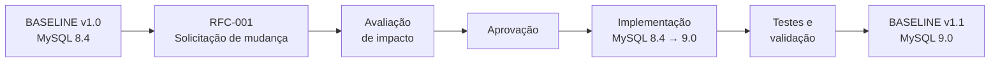
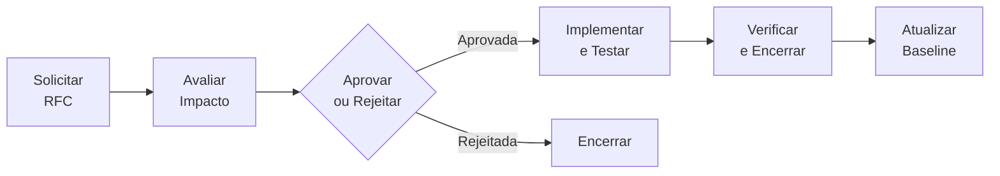
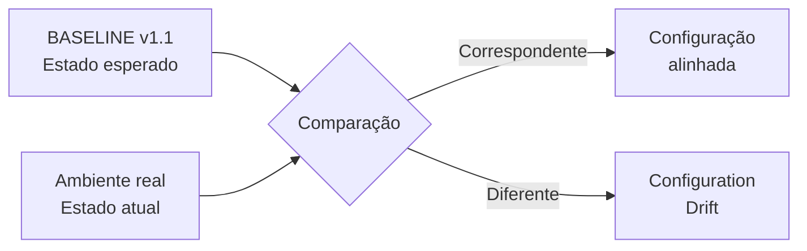

# BASELINE v1.1 — Sistema de Pedidos

> **Novo marco de referência da configuração oficial, estável e aprovada do Sistema de Pedidos após a implementação da RFC-001.**

---

## Identificação da Baseline

| Informação                     | Registro              |
| ------------------------------ | --------------------- |
| **Baseline**                   | v1.1                  |
| **Baseline anterior**          | v1.0                  |
| **Sistema**                    | Sistema de Pedidos    |
| **Status**                     | Aprovada              |
| **RFC relacionada**            | RFC-001               |
| **Mudança principal**          | MySQL 8.4 → MySQL 9.0 |
| **Data de criação**            | [Preencher]           |
| **Responsável pela aprovação** | [Preencher]           |

---

## O que representa a Baseline v1.1?

A **Baseline v1.1** representa um novo marco de referência no ciclo de vida do Sistema de Pedidos.

Uma baseline é formada por um **conjunto definido de Itens de Configuração (ICs) que foi revisado e aprovado**, estabelecendo qual deve ser o estado oficial do sistema naquele momento.

Neste cenário, a Baseline v1.1 foi criada após uma mudança controlada no banco de dados, passando de **MySQL 8.4 para MySQL 9.0**.

Assim, a v1.1 não representa apenas uma nova numeração. Ela registra o **estado aprovado da configuração do ambiente**, servindo como referência para desenvolvimento, testes, operação e futuras mudanças.

---

## Evolução da configuração

A evolução da configuração ocorreu a partir da Baseline v1.0 e foi conduzida por meio do processo formal de controle de mudanças.



A atividade determina que a mudança foi **aprovada, implementada e testada com sucesso**. Após a validação, o novo estado passou a ser registrado como **Baseline v1.1**.

---

## Itens de Configuração

A Baseline v1.1 é composta pelos seguintes **Itens de Configuração (ICs)**:

| Categoria          | Item                | Estado aprovado                 |
| ------------------ | ------------------- | ------------------------------- |
| **Sistema**        | Sistema             | Sistema de Pedidos — Versão 1.0 |
| **Aplicação**      | Node.js             | 22                              |
| **Aplicação**      | Express             | 5.1                             |
| **Aplicação**      | Porta               | 3000                            |
| **Banco de Dados** | SGBD                | **MySQL 9.0**                   |
| **Banco de Dados** | Banco               | pedidos                         |
| **Banco de Dados** | Porta               | 3306                            |
| **Infraestrutura** | Sistema Operacional | Ubuntu Server 24.04             |
| **Infraestrutura** | Memória RAM         | 4 GB                            |
| **Infraestrutura** | Processadores       | 2 vCPUs                         |
| **Código**         | Branch              | `main`                          |
| **Código**         | Commit              | `abc123`                        |

> **Observação:** a alteração ocorreu no banco de dados. Conforme o cenário da atividade, a aplicação e o código não foram alterados; por isso, a branch `main` e o commit `abc123` permanecem como referência.

---

## O que mudou da v1.0 para a v1.1?

A evolução entre as baselines foi **controlada e específica**:

| Item               |     v1.0 |     v1.1 | Situação     |
| ------------------ | -------: | -------: | ------------ |
| Node.js            |       22 |       22 | Mantido      |
| Express            |      5.1 |      5.1 | Mantido      |
| Porta da aplicação |     3000 |     3000 | Mantida      |
| **MySQL**          |  **8.4** |  **9.0** | **Alterado** |
| Banco              |  pedidos |  pedidos | Mantido      |
| Porta do banco     |     3306 |     3306 | Mantida      |
| Ubuntu Server      |    24.04 |    24.04 | Mantido      |
| RAM                |     4 GB |     4 GB | Mantida      |
| vCPUs              |        2 |        2 | Mantidas     |
| Branch             |   `main` |   `main` | Mantida      |
| Commit             | `abc123` | `abc123` | Mantido      |

### Mudança principal

> **MySQL 8.4 → MySQL 9.0**

Os demais Itens de Configuração permanecem conforme definidos na Baseline v1.0.

---

## Controle de Mudanças

A Baseline v1.1 é resultado de uma **mudança controlada**, seguindo o fluxo de Gerência de Configuração:



Esse processo garante que uma alteração não seja simplesmente aplicada ao ambiente sem avaliação, aprovação e validação.

A nova baseline passa a registrar o estado oficial somente após a conclusão do processo de mudança.

---

## Rastreabilidade

A evolução da configuração permanece relacionada ao histórico da mudança:

**Baseline v1.0**
↓
**RFC-001 — Solicitação de mudança**
↓
**Avaliação de impacto**
↓
**Aprovação**
↓
**MySQL 8.4 → MySQL 9.0**
↓
**Testes e validação**
↓
**Baseline v1.1**

Essa rastreabilidade permite identificar **qual mudança originou o novo estado da configuração**, facilitando futuras análises, auditorias e investigação de possíveis incidentes.

---

## Baseline e Configuration Drift

A Baseline v1.1 define o **estado esperado** do ambiente.

Se a configuração real permanecer de acordo com os Itens de Configuração registrados neste documento, o ambiente estará alinhado à baseline.

Por outro lado, uma alteração manual realizada posteriormente e sem o devido controle pode fazer com que o estado real do ambiente fique diferente do estado definido pela baseline.

Essa divergência caracteriza **Configuration Drift**.



Quando uma nova alteração for necessária, ela deverá passar novamente pelo processo de controle de mudanças. Após aprovação, implementação e validação, poderá ser criada uma nova baseline.

---

## Estabilidade e Evolução

A baseline não impede a evolução do sistema. Ela estabelece um **ponto de referência estável a partir do qual novas mudanças podem ser controladas e rastreadas**.

Isso permite que a equipe:

* trabalhe a partir de uma configuração oficial;
* mantenha maior consistência entre os ambientes;
* identifique alterações realizadas;
* reduza incompatibilidades de configuração;
* facilite a análise de causa raiz de problemas;
* mantenha o histórico de evolução do sistema.

Dessa forma:

> **Baseline significa estabilidade com possibilidade de evolução controlada.**

---

## Próxima evolução

A Baseline v1.1 permanecerá como referência até que uma nova mudança seja formalmente aprovada.

```text
Baseline v1.1
      ↓
Nova RFC
      ↓
Avaliação de impacto
      ↓
Aprovação
      ↓
Implementação e testes
      ↓
Validação
      ↓
Nova Baseline
```

Esse processo mantém a configuração do sistema **rastreável, controlada e alinhada ao estado oficialmente aprovado**.

---

## Registro de Aprovação

| Campo                 | Registro              |
| --------------------- | --------------------- |
| **Baseline**          | v1.1                  |
| **Baseline anterior** | v1.0                  |
| **RFC**               | RFC-001               |
| **Alteração**         | MySQL 8.4 → MySQL 9.0 |
| **Testes**            | Sucesso               |
| **Status**            | Aprovada              |
| **Responsável**       | [Preencher]           |
| **Data**              | [Preencher]           |

---

> **Baseline v1.1 — Sistema de Pedidos**
> Novo estado oficial após mudança controlada e validada.
> **Referência:** RFC-001
