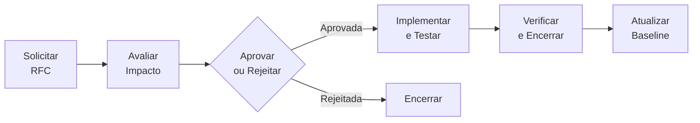
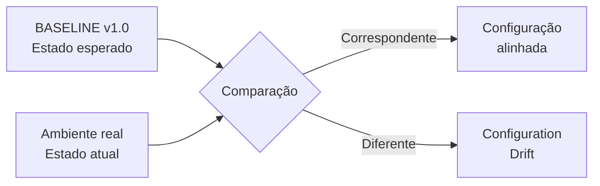
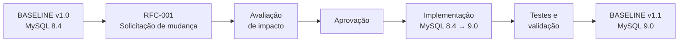

# Atividade Baseline


# BASELINE v1.0 — Sistema de Pedidos

> **Marco de referência inicial da configuração oficial, estável e aprovada do Sistema de Pedidos.**

---

## Identificação da Baseline

| Informação                     | Registro                        |
| ------------------------------- | -------------------------------- |
| **Baseline**                    | v1.0                             |
| **Baseline anterior**           | Nenhuma (baseline inicial)       |
| **Sistema**                     | Sistema de Pedidos               |
| **Status**                      | Aprovada                         |
| **RFC relacionada**             | Nenhuma (configuração inicial)   |
| **Data de criação**             | [16/08/2026]                      |
| **Responsável pela aprovação**  | [Vitor]                      |

---

## O que representa a Baseline v1.0?

A **Baseline v1.0** representa o **primeiro marco de referência** no ciclo de vida do Sistema de Pedidos.

Uma baseline é formada por um **conjunto definido de Itens de Configuração (ICs) que foi revisado e aprovado**, estabelecendo qual deve ser o estado oficial do sistema.

A equipe técnica recebeu a configuração abaixo, realizou os testes necessários e a aprovou como estado oficial do sistema, pronta para ser utilizada como referência para desenvolvimento, testes, operação e futuras mudanças.

---

## Itens de Configuração

| Categoria          | Item                 | Estado aprovado                 |
| ------------------- | -------------------- | -------------------------------- |
| **Sistema**          | Sistema              | Sistema de Pedidos — Versão 1.0  |
| **Aplicação**         | Node.js              | 22                                |
| **Aplicação**         | Express               | 5.1                               |
| **Aplicação**         | Porta                 | 3000                              |
| **Banco de Dados**    | SGBD                  | **MySQL 8.4**                    |
| **Banco de Dados**    | Banco                 | pedidos                          |
| **Banco de Dados**    | Porta                 | 3306                              |
| **Infraestrutura**    | Sistema Operacional   | Ubuntu Server 24.04               |
| **Infraestrutura**    | Memória RAM           | 4 GB                              |
| **Infraestrutura**    | Processadores         | 2 vCPUs                           |
| **Código**            | Branch                | `main`                            |
| **Código**            | Commit                | `abc123`                          |

> **Observação:** esta é a configuração validada pela equipe técnica e aprovada como estado inicial oficial do sistema, servindo de base para qualquer mudança futura.

---

## Controle de Mudanças

Como baseline inicial, a v1.0 **não decorre de uma RFC** — ela é o resultado da validação e aprovação da primeira configuração estável do sistema.

A partir deste ponto, qualquer alteração no ambiente deve seguir o processo formal de Gerência de Configuração:



Garante que, a partir da v1.0, nenhuma alteração seja aplicada ao ambiente sem avaliação, aprovação e validação.

---

## Rastreabilidade

A Baseline v1.0 é o ponto de origem do histórico de configuração do sistema:

**Baseline v1.0** — *estado inicial aprovado*
↓
*(futuras RFCs e mudanças controladas)*
↓
**Próximas Baselines**

Todo o histórico de evolução do sistema, incluindo toda mudança futura aprovada por meio de RFC, parte deste registro inicial.

---

## Baseline e Configuration Drift

A Baseline v1.0 define o **estado esperado** do ambiente logo após sua aprovação.

Se a configuração real permanecer de acordo com os Itens de Configuração registrados neste documento, o ambiente estará alinhado à baseline.

Uma alteração manual realizada sem passar pelo processo formal de controle de mudanças faria o estado real divergir do estado definido pela baseline, caracterizando **Configuration Drift**.



---

## Estabilidade e Evolução

A Baseline v1.0 estabelece o **ponto de referência estável inicial** a partir dela toda a evolução futura do sistema será controlada e rastreada.

Isso permite que a equipe:

* trabalhe a partir de uma configuração oficial desde o início do projeto;
* mantenha consistência entre os ambientes;
* identifique com clareza qualquer alteração futura;
* reduza incompatibilidades de configuração;
* mantenha o histórico completo da evolução do sistema.

---

## Próxima evolução

A Baseline v1.0 permanece como referência até que uma nova mudança seja formalmente aprovada.

```text
Baseline v1.0
      ↓
Nova RFC
      ↓
Avaliação de impacto
      ↓
Aprovação
      ↓
Implementação e testes
      ↓
Validação
      ↓
Nova Baseline
```

---

## Registro de Aprovação

| Campo                  | Registro                       |
| ------------------------ | -------------------------------- |
| **Baseline**              | v1.0                             |
| **Baseline anterior**     | Nenhuma (baseline inicial)       |
| **RFC**                   | Nenhuma (configuração inicial)   |
| **Testes**                | Sucesso                          |
| **Status**                | Aprovada                         |
| **Responsável**           | [Vitor]                      |
| **Data**                  | [16/08/2026]                      |

---

> **Baseline v1.0 — Sistema de Pedidos**
> Estado oficial inicial, validado e aprovado pela equipe técnica.
> **Referência:** ponto de partida para futuras mudanças controladas


## Importância da Baseline

Uma baseline é de grande importância para sabermos quais configurações foram usadas em um sistema, servindo como ponto de 
referência confiável que mantém os ambientes parecidos entre si e reduz incompatibilidades de versões, guardando itens de 
configuração e registros de alterações e aprovações. Garante mais segurança em casos de problemas, permitindo que a equipe 
identifique facilmente o último estado estável e retorne a ele, além de sustentar uma automação estável, já que se se sabe 
exatamente qual é o estado esperado. Já quando alterações são feitas sem controle de configuração, o ambiente passa a 
se separar do que está documentado, o que dificulta a identificação de erros.

## Desafio 2 – Mudança não autorizada

### Incidente
*"Um administrador percebeu que o banco MySQL 8.4 estava apresentando problemas de
desempenho e decidiu atualizar diretamente o servidor de produção para MySQL 9.0. A
aplicação continuou utilizando as mesmas configurações e o código não foi alterado. Após a
atualização, algumas consultas começaram a apresentar erros."*

### 1. A baseline foi alterada? Por quê?

Sim, a configuração real do ambiente deixou de corresponder à pré-definida na baseline v1.0, que especificava o MySQL 8.4 e foi alterada para o MySQL 9.0. Isso fez com que o estado do ambiente ficasse diferente do estado oficial aprovado.

### 2. Qual Item de Configuração (IC) foi modificado?

Foi o banco de dados MySQL, que passou da versão 8.4 para a versão 9.0.

### 3. Essa alteração deveria ter sido realizada diretamente em produção?

Não, pois modificou um IC que fazia parte da baseline aprovada sem análise precisa.

### 4. Qual processo deveria ter sido executado antes da alteração?

Deveria ter sido realizada uma RFC (solicitação formal de mudança), seguida pela avaliação do impacto, aprovação ou rejeição, implementação, testes e verificação da alteração.

Fluxo: Solicitar → Avaliar impacto → Aprovar/Rejeitar → Implementar/Testar → Verificar/Encerrar.

### 5. O que deve acontecer com a baseline após uma mudança aprovada?

Deve ser criada uma nova baseline representando o novo estado oficial e aprovado do sistema. A baseline v1.0 cede o lugar à baseline v1.1, que tem o MySQL 9.0.

# Solicitação de Mudança: RFC-001

**IC afetado:** Banco de Dados (MySQL)

**Versão atual:** MySQL 8.4

**Versão proposta:** MySQL 9.0

**Motivo da mudança:**
O MySQL 8.4 está apresentando problemas de desempenho em produção, causando lentidão
e, após uma tentativa de correção não autorizada, erros em consultas. A atualização para
a versão 9.0 visa corrigir os problemas de performance de forma planejada e testada.

**Riscos:**
- Incompatibilidade de queries/sintaxe entre versões do MySQL.
- Possível indisponibilidade durante a migração.
- Comportamento inesperado em funcionalidades não testadas previamente.
- Necessidade de rollback caso a nova versão não seja estável.

**Impacto na aplicação:**
A aplicação Node.js/Express depende diretamente do banco de dados. Alterações na versão
do MySQL podem afetar drivers de conexão, queries e comportamento de transações,
exigindo validação completa antes da liberação em produção.

**Ambientes afetados:**
- Ambiente de desenvolvimento (testes iniciais)
- Ambiente de homologação/staging
- Ambiente de produção (aplicação final)

**Testes necessários:**
- Testes de compatibilidade da aplicação com MySQL 9.0
- Testes de regressão das principais funcionalidades do Sistema de Pedidos
- Testes de performance (comparação antes/depois)
- Testes de rollback

**Plano de implementação:**
1. Provisionar ambiente de homologação com MySQL 9.0.
2. Migrar uma cópia do banco `pedidos` para o novo ambiente.
3. Executar bateria de testes funcionais e de performance.
4. Validar resultados com a equipe técnica.
5. Agendar janela de manutenção para atualização em produção.
6. Atualizar produção e monitorar comportamento pós-implantação.

**Plano de rollback:**
Manter backup completo do banco MySQL 8.4 antes da migração. Em caso de falha crítica,
reverter para a versão 8.4 restaurando o backup e redirecionando a aplicação para a
instância anterior, dentro da janela de manutenção definida.

**Responsável:**
Administrador de Banco de Dados / Equipe de Infraestrutura

**Aprovação:**
Aprovado pela equipe técnica responsável, seguindo o fluxo:
Solicitar → Avaliar impacto → Aprovar/Rejeitar → Implementar/Testar → Verificar/Encerrar

# BASELINE v1.1 — Sistema de Pedidos

> **Novo marco de referência da configuração oficial, estável e aprovada do Sistema de Pedidos após a implementação da RFC-001.**

---

## Identificação da Baseline

| Informação                     | Registro              |
| ------------------------------ | --------------------- |
| **Baseline**                   | v1.1                  |
| **Baseline anterior**          | v1.0                  |
| **Sistema**                    | Sistema de Pedidos    |
| **Status**                     | Aprovada              |
| **RFC relacionada**            | RFC-001               |
| **Mudança principal**          | MySQL 8.4 → MySQL 9.0 |
| **Data de criação**            | [16/08/2026]           |
| **Responsável pela aprovação** | [Vitor]           |

---

## O que representa a Baseline v1.1?

A **Baseline v1.1** representa um novo marco de referência no ciclo de vida do Sistema de Pedidos.

Uma baseline é formada por um **conjunto definido de Itens de Configuração (ICs) que foi revisado e aprovado**, estabelecendo qual deve ser o estado oficial do sistema naquele momento.

Neste cenário, a Baseline v1.1 foi criada após uma mudança controlada no banco de dados, passando de **MySQL 8.4 para MySQL 9.0**.

Assim, a v1.1 não representa apenas uma nova numeração. Ela registra o **estado aprovado da configuração do ambiente**, servindo como referência para desenvolvimento, testes, operação e futuras mudanças.

---

## Evolução da configuração

A evolução da configuração ocorreu a partir da Baseline v1.0 e foi conduzida por meio do processo formal de controle de mudanças.



A atividade determina que a mudança foi **aprovada, implementada e testada com sucesso**. Após a validação, o novo estado passou a ser registrado como **Baseline v1.1**.

---

## Itens de Configuração

A Baseline v1.1 é composta pelos seguintes **Itens de Configuração (ICs)**:

| Categoria          | Item                | Estado aprovado                 |
| ------------------ | ------------------- | ------------------------------- |
| **Sistema**        | Sistema             | Sistema de Pedidos — Versão 1.0 |
| **Aplicação**      | Node.js             | 22                              |
| **Aplicação**      | Express             | 5.1                             |
| **Aplicação**      | Porta               | 3000                            |
| **Banco de Dados** | SGBD                | **MySQL 9.0**                   |
| **Banco de Dados** | Banco               | pedidos                         |
| **Banco de Dados** | Porta               | 3306                            |
| **Infraestrutura** | Sistema Operacional | Ubuntu Server 24.04             |
| **Infraestrutura** | Memória RAM         | 4 GB                            |
| **Infraestrutura** | Processadores       | 2 vCPUs                         |
| **Código**         | Branch              | `main`                          |
| **Código**         | Commit              | `abc123`                        |

> **Observação:** a alteração ocorreu no banco de dados. Conforme o cenário da atividade, a aplicação e o código não foram alterados; por isso, a branch `main` e o commit `abc123` permanecem como referência.

---

## O que mudou da v1.0 para a v1.1?

A evolução entre as baselines foi **controlada e específica**:

| Item               |     v1.0 |     v1.1 | Situação     |
| ------------------ | -------: | -------: | ------------ |
| Node.js            |       22 |       22 | Mantido      |
| Express            |      5.1 |      5.1 | Mantido      |
| Porta da aplicação |     3000 |     3000 | Mantida      |
| **MySQL**          |  **8.4** |  **9.0** | **Alterado** |
| Banco              |  pedidos |  pedidos | Mantido      |
| Porta do banco     |     3306 |     3306 | Mantida      |
| Ubuntu Server      |    24.04 |    24.04 | Mantido      |
| RAM                |     4 GB |     4 GB | Mantida      |
| vCPUs              |        2 |        2 | Mantidas     |
| Branch             |   `main` |   `main` | Mantida      |
| Commit             | `abc123` | `abc123` | Mantido      |

### Mudança principal

> **MySQL 8.4 → MySQL 9.0**

Os demais Itens de Configuração permanecem conforme definidos na Baseline v1.0.

---

## Controle de Mudanças

A Baseline v1.1 é resultado de uma **mudança controlada**, seguindo o fluxo de Gerência de Configuração:


Esse processo garante que uma alteração não seja simplesmente aplicada ao ambiente sem avaliação, aprovação e validação.

A nova baseline passa a registrar o estado oficial somente após a conclusão do processo de mudança.

---

## Rastreabilidade

A evolução da configuração permanece relacionada ao histórico da mudança:

**Baseline v1.0**
↓
**RFC-001 — Solicitação de mudança**
↓
**Avaliação de impacto**
↓
**Aprovação**
↓
**MySQL 8.4 → MySQL 9.0**
↓
**Testes e validação**
↓
**Baseline v1.1**

Essa rastreabilidade permite identificar **qual mudança originou o novo estado da configuração**, facilitando futuras análises, auditorias e investigação de possíveis incidentes.

---

## Baseline e Configuration Drift

A Baseline v1.1 define o **estado esperado** do ambiente.

Se a configuração real permanecer de acordo com os Itens de Configuração registrados neste documento, o ambiente estará alinhado à baseline.

Por outro lado, uma alteração manual realizada posteriormente e sem o devido controle pode fazer com que o estado real do ambiente fique diferente do estado definido pela baseline.

Essa divergência caracteriza **Configuration Drift**.


Quando uma nova alteração for necessária, ela deverá passar novamente pelo processo de controle de mudanças. Após aprovação, implementação e validação, poderá ser criada uma nova baseline.

---

## Estabilidade e Evolução

A baseline não impede a evolução do sistema. Ela estabelece um **ponto de referência estável a partir do qual novas mudanças podem ser controladas e rastreadas**.

Isso permite que a equipe:

* trabalhe a partir de uma configuração oficial;
* mantenha maior consistência entre os ambientes;
* identifique alterações realizadas;
* reduza incompatibilidades de configuração;
* facilite a análise de causa raiz de problemas;
* mantenha o histórico de evolução do sistema.

Dessa forma:

> **Baseline significa estabilidade com possibilidade de evolução controlada.**

---

## Próxima evolução

A Baseline v1.1 permanecerá como referência até que uma nova mudança seja formalmente aprovada.

```text
Baseline v1.1
      ↓
Nova RFC
      ↓
Avaliação de impacto
      ↓
Aprovação
      ↓
Implementação e testes
      ↓
Validação
      ↓
Nova Baseline
```

Esse processo mantém a configuração do sistema **rastreável, controlada e alinhada ao estado oficialmente aprovado**.

---

## Registro de Aprovação

| Campo                 | Registro              |
| --------------------- | --------------------- |
| **Baseline**          | v1.1                  |
| **Baseline anterior** | v1.0                  |
| **RFC**               | RFC-001               |
| **Alteração**         | MySQL 8.4 → MySQL 9.0 |
| **Testes**            | Sucesso               |
| **Status**            | Aprovada              |
| **Responsável**       | [Vitor]           |
| **Data**              | [16/08/2026]           |

---

> **Baseline v1.1 — Sistema de Pedidos**
> Novo estado oficial após mudança controlada e validada.
> **Referência:** RFC-001

## Configuration Drift

| Situação | É mudança controlada? | Está na baseline? |
|----------|------------------------|--------------------|
| Desenvolvedor altera o código e realiza um novo commit | **Não**, a menos que passe por revisão/aprovação e vire uma nova baseline | **Não**, até ser formalmente aprovada e incorporada a uma nova baseline |
| Administrador altera manualmente uma configuração em produção | **Não** | **Não** — representa um Configuration Drift em relação à baseline vigente |
| Mudança aprovada e documentada gera a baseline v1.1 | **Sim** | **Sim** — passa a ser o novo estado oficial do sistema |

**Se alguém alterar manualmente o servidor depois da baseline v1.1, o que aconteceu com a configuração do ambiente?**

O ambiente volta a divergir do estado oficial documentado, gerando um novo **Configuration Drift**. Mesmo com a baseline v1.1 registrada, o ambiente real deixa de refletir o que está formalmente aprovado, criando risco de inconsistência, dificuldade de diagnóstico de problemas e perda de rastreabilidade — até que a divergência seja identificada e corrigida (revertida ou formalizada por meio de uma nova RFC/baseline)