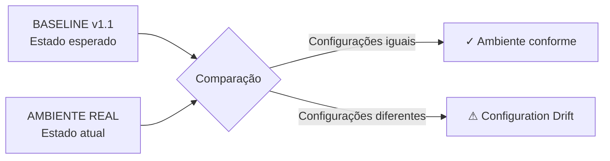
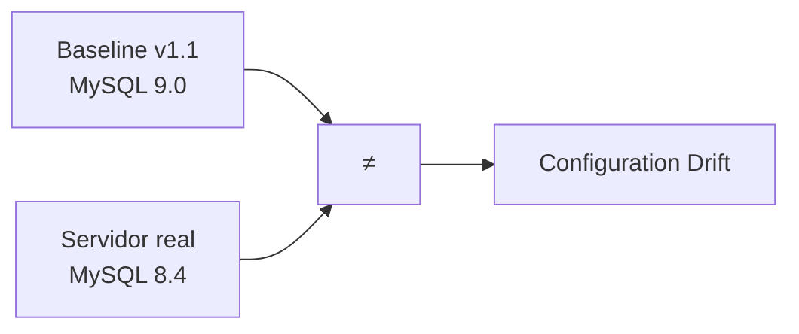
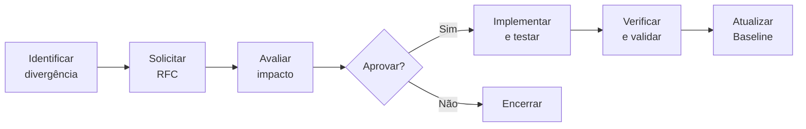
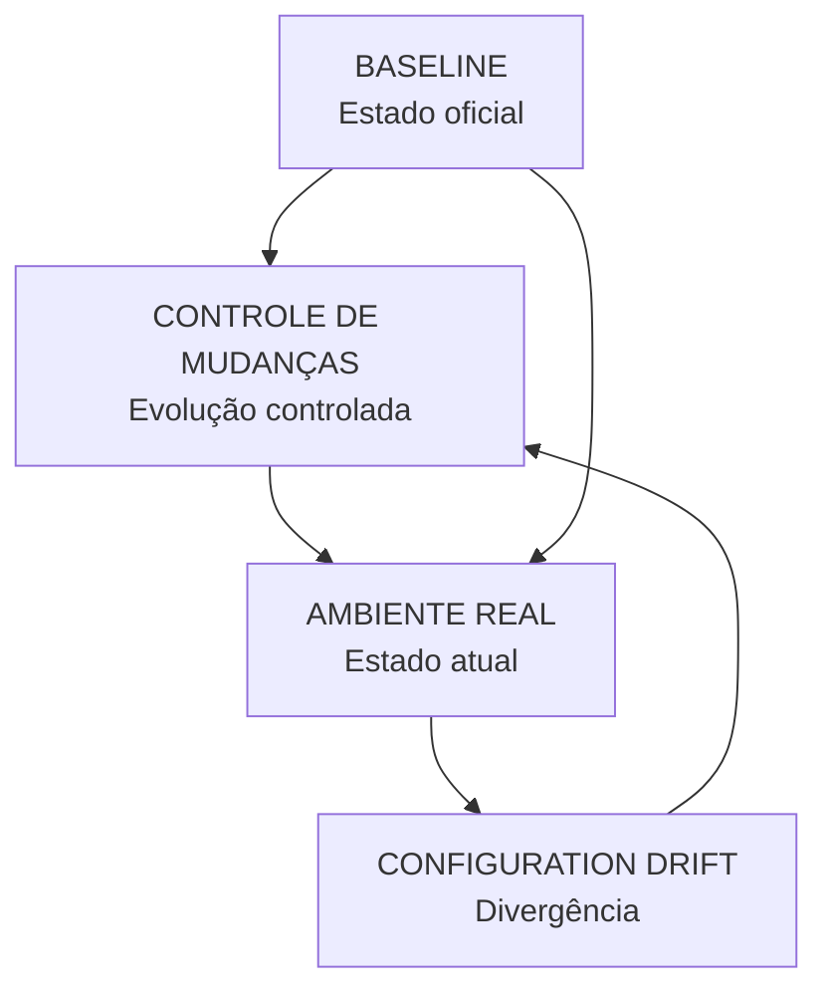

# Atividade — Gerência de Configuração e Controle de Mudanças

## Configuration Drift

> **Configuration Drift** é a divergência entre o estado esperado de um ambiente, definido pela Baseline, e o estado real encontrado nesse ambiente.

No Sistema de Pedidos, a **Baseline v1.1** representa o estado oficial e aprovado da configuração após a mudança do **MySQL 8.4 para o MySQL 9.0**.

A partir da criação da Baseline v1.1, ela passa a ser utilizada como referência para verificar se o ambiente permanece de acordo com a configuração aprovada.

---

### Análise das situações

| Situação                                                           | É mudança controlada?  | Está na Baseline v1.1? | Análise                                                                                                                                                                                         |
| ------------------------------------------------------------------ | ---------------------- | ---------------------- | ----------------------------------------------------------------------------------------------------------------------------------------------------------------------------------------------- |
| **Desenvolvedor altera o código e realiza um novo commit.**        | ⚠️ Não necessariamente | ❌ Não                  | O commit registra e versiona a alteração, fornecendo rastreabilidade. Porém, o commit por si só não significa que a mudança foi formalmente aprovada ou incorporada à baseline.                 |
| **Administrador altera manualmente uma configuração em produção.** | ❌ Não                  | ❌ Não                  | A alteração foi realizada diretamente no ambiente, sem passar pelo processo formal de controle de mudanças. Se o estado real ficar diferente da Baseline v1.1, caracteriza Configuration Drift. |
| **Mudança aprovada e documentada gera a Baseline v1.1.**           | ✅ Sim                  | ✅ Sim                  | A mudança passou pelo processo de controle, foi implementada, testada e aprovada. O novo estado foi formalmente registrado como Baseline v1.1.                                                  |

> **Observação:** versionamento e controle de mudanças são conceitos relacionados, mas não equivalentes. O commit registra uma alteração no histórico do código, enquanto o processo de Gerência de Configuração determina se uma mudança foi avaliada, aprovada, implementada e validada.

---

### Baseline como referência

A Baseline funciona como um ponto de comparação entre a configuração oficialmente aprovada e a configuração existente no ambiente.



Enquanto o ambiente real permanecer de acordo com os Itens de Configuração registrados na Baseline v1.1, o ambiente estará alinhado ao estado aprovado.

Quando uma alteração fizer com que o ambiente real fique diferente da configuração registrada na baseline, será necessário analisar a origem dessa divergência.

---

### Exemplo aplicado ao Sistema de Pedidos

A Baseline v1.1 estabelece:

```text
Banco de Dados
MySQL 9.0
```

Se, posteriormente, um administrador alterar manualmente o servidor e retornar a configuração para:

```text
Banco de Dados
MySQL 8.4
```

teremos uma diferença entre o estado esperado e o estado real:



Nesse cenário, a Baseline continua definindo **MySQL 9.0** como estado oficial, enquanto o ambiente real apresenta **MySQL 8.4**.

Essa divergência caracteriza Configuration Drift.

---

### Como tratar uma divergência

Quando uma alteração for necessária, ela deverá seguir o processo formal de controle de mudanças:



Dessa forma, uma alteração necessária pode deixar de ser uma mudança não controlada e passar a fazer parte do processo oficial de evolução da configuração.

---

### Relação entre Baseline, Controle de Mudanças e Configuration Drift

| Conceito                 | Função                                                                        |
| ------------------------ | ----------------------------------------------------------------------------- |
| **Baseline**             | Define o estado oficial e aprovado da configuração.                           |
| **Controle de Mudanças** | Permite que alterações sejam avaliadas, aprovadas, implementadas e validadas. |
| **Configuration Drift**  | Representa a divergência entre o estado esperado e o estado real do ambiente. |



A Baseline fornece a referência, o Controle de Mudanças organiza a evolução e o Configuration Drift permite identificar quando o ambiente real deixa de corresponder ao estado oficialmente definido.

---

### Conclusão

A Baseline permite que a equipe tenha uma referência clara sobre qual configuração é considerada oficial.

Quando o ambiente real se distancia dessa referência sem que a mudança tenha sido devidamente controlada e registrada, ocorre **Configuration Drift**.

No Sistema de Pedidos, a **Baseline v1.1 estabelece o MySQL 9.0 como configuração aprovada**. Alterações posteriores deverão seguir o processo de controle de mudanças para preservar a estabilidade, a rastreabilidade e a consistência do ambiente.
